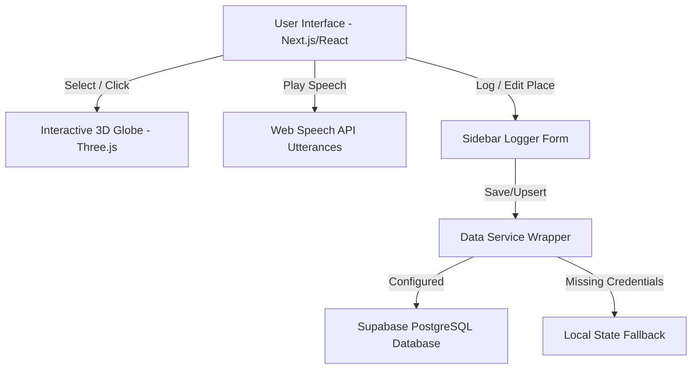

# Kitchen Confidential: Anthony Bourdain's Travel Tool

An immersive, cinematic travel journaling and food tasting application inspired by the storytelling spirit of Anthony Bourdain. Built to showcase high-fidelity frontend artistry, clean relational database integrations, and comfort co-piloting with AI engineering systems.

---

## 🎯 Alignment with the Target Job Description

This project was built from scratch to directly demonstrate the key competencies you are looking for:

*   **Strong Frontend Skills (React 19 / Next.js 15)**: Custom styled dark-mode layouts, dynamic transitions (Framer Motion), interactive 3D WebGL visualizations (Three.js), and browser APIs integration (Web Speech synthesis boundary tracking).
*   **Basic Backend & Database Knowledge**: Relational schema design (PostgreSQL) mapped through Supabase client wrappers, cascading transactions (relational updates), and public Row-Level Security (RLS) policies.
*   **Comfort with AI Coding Tools**: Successfully directed agentic systems (Antigravity) to rapidly scaffold, refactor, and compile this application, acting as the lead architect and taking complete ownership of code quality.
*   **Creative & Detail-Oriented**: Tactile 3D-tilting elements, a dynamic local clock calculated mathematically from coordinate longitudes, a retro voice cassette player, and a fully embedded sidebar coordinate-pinning creator.

---

## 🚀 Key Features

### 1. Interactive 3D WebGL Globe
*   A client-side dynamic WebGL sphere rendered with night-light contours.
*   Interactive flight path arcs (glowing, animated dash-pulses) linking visited cities in chronological order.
*   Clicking a coordinate marker on the globe triggers a camera fly-to animation and highlights its logs in the journal.

### 2. Retro Voice Dispatch (Audio Player Simulator)
*   A physical-looking retro cassette player with rotating reels and an oscillating audio equalizer.
*   Uses the **HTML5 Web Speech API** to read Bourdain quotes in a slow, deep cadence.
*   Hooks into spoken word boundary indexes to **highlight the transcript word-by-word in real-time** as it speaks.

### 3. Coordinate-Pinning Travel Logger (UX-First)
*   No blocking modal overlays. Toggling "+ Log Journey" transforms the sidebar into an input form, keeping the globe fully visible.
*   Clicking anywhere on the spinning 3D Globe instantly drops a temporary red pin and **auto-fills the Latitude & Longitude** form fields.
*   Features a **Bourdain Dispatch Synthesizer** that dynamically authors custom quotes and observations matching his signature voice for newly logged cities.

### 4. Dynamic local Environment HUD
*   Displays real-time timezones computed mathematically from the selected location's coordinates:
    $$\text{timezone\_offset} = \text{round}\left(\frac{\text{longitude}}{15}\right)$$
*   Displays Bourdain's atmospheric notes detailing the scents and sounds of the local air.

### 5. Tactile Passport Stamps
*   Displays customized arrival stamps with distress-styled, vector-based country geometries (Hanoi circles, Marrakech octagons, Paris rectangles).
*   Uses Framer Motion to apply 3D cursor hover-tilts.

---

## 🛠️ Tech Stack & Architecture



*   **Framework**: Next.js 15 (App Router), React 19, TypeScript
*   **Styling**: Tailwind CSS v4, Vanilla CSS Design Tokens
*   **Graphics**: Three.js, `react-globe.gl`
*   **Animations**: Framer Motion
*   **Database**: Supabase / PostgreSQL (Relational layout with RLS selects & inserts)

---

## 📥 Getting Started

### 1. Clone & Install Dependencies
```bash
git clone https://github.com/deepalj/bourdain-travel-tool.git
cd bourdain-travel-tool
npm install
```

### 2. Configure Supabase Database (Optional)

This application has a built-in **failover data service**. If you don't configure Supabase credentials, it runs in **Mock Fallback Mode** (indicated in the sidebar footer), using local mock data. Any new dispatches or edits you make will save to the local React state.

To connect your own live Supabase database and run it in live database mode, follow these steps:

#### Step A: Provision the Supabase Project
1. Go to [Supabase](https://supabase.com) and sign up for a free account.
2. Click **New Project** and name it (e.g., `bourdain-travel-tool`). Set your database password and choose a region close to you.
3. Once the database is provisioned, go to the **SQL Editor** tab in the left sidebar of your Supabase dashboard.
4. Click **New Query**, then copy and paste the entire contents of the [supabase-schema.sql](file:///Users/deepaljain/Desktop/project%200/supabase-schema.sql) file located at the root of this project.
5. Click **Run** to execute the script. This will instantly:
   * Create the `destinations`, `culinary_highlights`, and `lessons` tables.
   * Configure foreign key constraints and validation checks (like chili ranges).
   * Enable Row-Level Security (RLS) for public selects and inserts (so any visitor can view and log travels on your demo site).
   * Seed the database with the initial 5 travel logs.

#### Step B: Set up Environment Variables
1. In your Supabase dashboard, navigate to **Project Settings** (gear icon) -> **API**.
2. Copy the **Project URL** and the **`anon` `public` API Key**.
3. Create a new file named `.env.local` at the root of this project:
   ```env
   NEXT_PUBLIC_SUPABASE_URL=your-copied-project-url
   NEXT_PUBLIC_SUPABASE_ANON_KEY=your-copied-anon-public-key
   ```
4. Restart your local server. The sidebar footer will now glow green and read: **`DB: SUPABASE LIVE`**!

### 3. Run Locally
```bash
npm run dev
```
Open **[http://localhost:3000](http://localhost:3000)** (or `3001` if port 3000 is occupied) in your browser.
