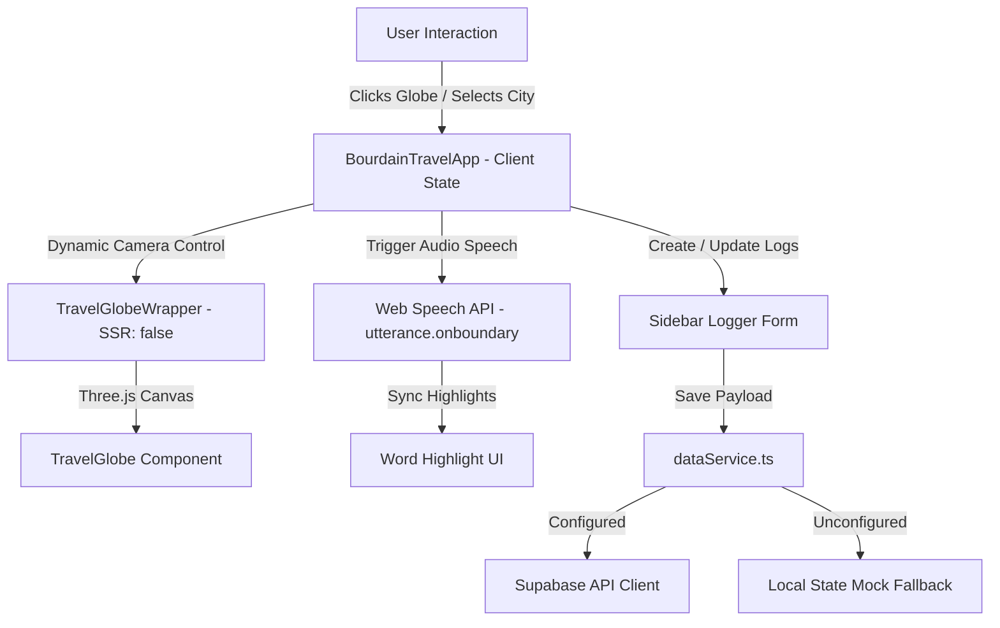

# Kitchen Confidential: Anthony Bourdain's Travel Tool

An immersive, cinematic travel journaling and culinary diary application inspired by the storytelling spirit of Anthony Bourdain. This application is custom-built to showcase advanced frontend capabilities, clean relational database architecture, and a detail-oriented, ownership-first approach to building products.

---

## 🎯 Profile Alignment: Why I Fit Your Engineering Team

This project was built from the ground up to demonstrate exact alignment with your job description:

| Requirement | How this Project Demonstrates It | Core Implementation |
| :--- | :--- | :--- |
| **Strong Frontend Skills** | Interactive, fluid, and optimized Next.js 15 app with dynamic WebGL rendering and sensory micro-interactions. | `three.js`, `react-globe.gl`, `framer-motion`, Tailwind CSS v4 |
| **Basic Backend & DB Knowledge** | Designed a relational database layout, authored transaction scripts, and integrated client-side fetching wrappers with failovers. | Supabase, PostgreSQL, Relational SQL schemas, RLS Policies |
| **Comfort using AI Coding Tools** | Directed agentic coders to scaffold infrastructure and build custom helpers, maintaining strict architectural oversight. | Co-piloted with Antigravity, clean code refactoring, TS safety |
| **Creativity & Detail-Oriented** | tactile 3D-tilting objects, dynamic timezone clock math, custom sound visualizers, and automatic Bourdain quote synthesis. | Web Speech API word boundaries, dynamic GMT calculation, custom SVG reels |
| **Ownership of Product Features** | Identified UX blockages (e.g., modals overlaying globe clicks) and refactored the form directly into the sidebar panel. | Self-directed UX refactoring, robust error-handling, local state failovers |

---

## 🛠️ System Architecture



---

## 📂 Project Directory Structure

```text
├── src/
│   ├── app/
│   │   ├── favicon.ico
│   │   ├── globals.css          # Design tokens, custom scrollbars, text shadows, grain overlays
│   │   ├── layout.tsx           # Google Fonts (Playfair Display, Inter, JetBrains Mono) & SEO
│   │   └── page.tsx             # Main server-side page mount
│   ├── components/
│   │   ├── BourdainTravelApp.tsx # Main client manager: coordinate form, sidebar, states
│   │   ├── BuilderDrawer.tsx    # Slide-over cabinet: developer profile & system specifications
│   │   ├── EnvironmentHUD.tsx   # Live local clock & weather atmospheric details
│   │   ├── PassportStamps.tsx   # 3D tilted vector stamp geometry
│   │   ├── RetroVoiceDispatch.tsx # Cassette deck controller, visualizer waves, Web Speech audio
│   │   ├── TravelGlobe.tsx      # WebGL three.js globe configuration, flight arcs, marker points
│   │   └── TravelGlobeWrapper.tsx # next/dynamic SSR client-side canvas loader
│   ├── data/
│   │   └── destinations.ts      # High-fidelity mock seeds & TypeScript interfaces
│   └── utils/
│       ├── bourdainGenerator.ts # Poetic Bourdain-esque quote and observation generator
│       ├── dataService.ts       # Supabase client wrapper & relational cascade save operations
│       ├── supabase.ts          # Database client connector & credentials validator
│       └── timezone.ts          # Mathematical timezone GMT offset estimator from raw coordinates
├── supabase-schema.sql          # Relational SQL schema build & seed scripts
├── package.json                 # Project dependencies configuration
└── README.md                    # System documentation
```

---

## 🚀 Technical Deep-Dive: Core Engineering Challenges Solved

### 1. SSR Hydration Mismatch with WebGL Canvas
*   **Problem**: Next.js App Router pre-renders pages on the server. WebGL and Three.js rely on browser-only window/document APIs and canvas contexts, throwing compilation errors and hydration mismatches.
*   **Solution**: Created `TravelGlobeWrapper.tsx` utilizing Next.js `dynamic` lazy-loading with `{ ssr: false }`, mounting a retro monospace loading spinner during server hydration and rendering the WebGL canvas smoothly on client-side mount.

### 2. Audio-Text Boundary Synchronization (Web Speech API)
*   **Problem**: Animating transcripts word-by-word in sync with voice dispatches usually requires heavy pre-recorded media files or complex timestamp subtitle files.
*   **Solution**: Integrated browser-native `window.speechSynthesis`. Configured a low-pitch voice at a slow, poetic rate ($0.82$) to simulate Bourdain's cadence. Hooked into the utterance `onboundary` event, matching character offsets in the raw string to split word indexes, allowing the UI to highlight spoken words in real-time. Created an automatic visual timer fallback for muted users.

### 3. Dynamic Local Time from Raw Longitude Coordinates
*   **Problem**: Newly logged cities do not have timezone metadata, making it difficult to display local clocks without invoking heavy geolocation APIs.
*   **Solution**: Created a mathematical timezone estimator inside `timezone.ts`. Since the earth rotates $360^\circ$ in 24 hours, each hour represents exactly $15^\circ$ of longitude. 
    $$\text{GMT\_Offset} = \text{round}\left(\frac{\text{Longitude}}{15}\right)$$
    This formula computes timezone offsets in real-time for any coordinate on earth. A custom lookup handles DST variances for core locations.

### 4. Database Failover & Cascade Relational Operations
*   **Problem**: Ensuring database connectivity while keeping the portfolio 100% operational for reviewers who haven't set up Supabase.
*   **Solution**: Developed a data proxy layer inside `dataService.ts`. If environment variables are missing, it transparently routes requests to a local state engine (indicated in the UI as `DB: MOCK FALLBACK`).
*   Additionally, because Supabase doesn't natively handle nested JSON array updates for child relationships (`culinary_highlights` and `lessons`), `saveDestination` executes a cascade transaction: it upserts the parent destination, runs clean deletions on child references for the selected ID, and inserts the fresh edited arrays, preventing database bloat.

---

## 📥 Local Installation & Database Setup

### 1. Clone the Repository
```bash
git clone https://github.com/deepalj/bourdain-travel-tool.git
cd bourdain-travel-tool
npm install
```

### 2. Configure Supabase (Optional - Failover is Enabled)
To hook up a live database, follow these steps:
1.  Sign up for a free project on [Supabase](https://supabase.com).
2.  Open the **SQL Editor** in your Supabase dashboard and create a **New Query**.
3.  Copy and paste the entire contents of [supabase-schema.sql](file:///Users/deepaljain/Desktop/project%200/supabase-schema.sql) and click **Run**. This provisions your tables, configures foreign key relationships, enables Row-Level Security (RLS) policies for select/insert, and seeds initial data.
4.  Go to **Project Settings** -> **API** on your Supabase dashboard.
5.  Create a `.env.local` file at the root of this project and paste your keys:
    ```env
    NEXT_PUBLIC_SUPABASE_URL=your-project-url
    NEXT_PUBLIC_SUPABASE_ANON_KEY=your-anon-public-key
    ```
6.  Boot up the app, and the sidebar badge will glow green to display: **`DB: SUPABASE LIVE`**!

### 3. Start Development Server
```bash
npm run dev
```
Open **[http://localhost:3000](http://localhost:3000)** (or `3001` if port 3000 is occupied).
