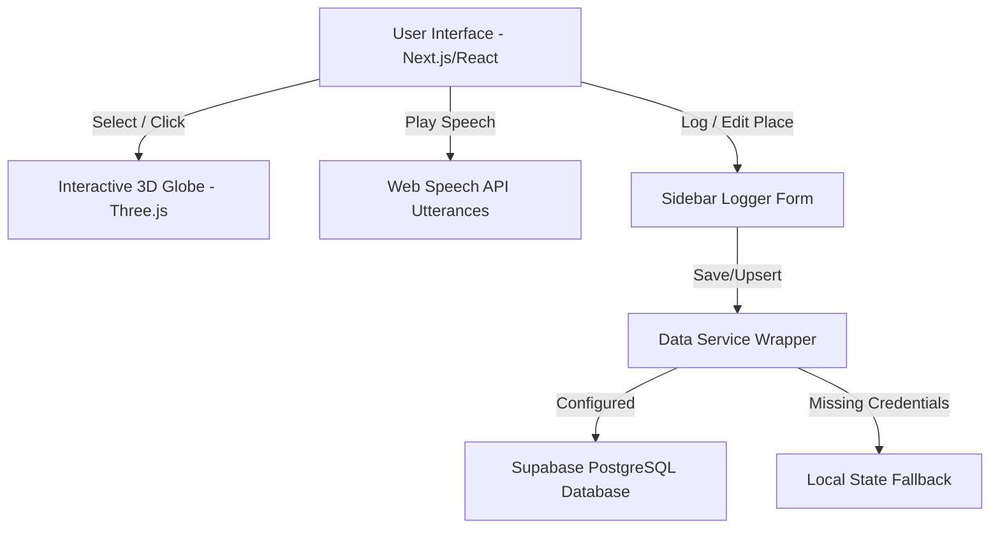

# Kitchen Confidential: Anthony Bourdain's Travel Tool

An immersive, cinematic travel journaling and food tasting application inspired by the storytelling spirit of Anthony Bourdain. Built to showcase high-fidelity frontend artistry, clean relational database integrations, and comfort co-piloting with AI engineering systems.

---

## 🎯 Alignment with the Target Job Description

This project was built from scratch to directly demonstrate the key competencies you are looking for:

*   **Strong Frontend Skills (React 19 / Next.js 15)**: Custom styled dark-mode layouts, dynamic transitions (Framer Motion), interactive 3D WebGL visualizations (Three.js), and browser APIs integration (Web Speech synthesis boundary tracking).
*   **Basic Backend & Database Knowledge**: Relational schema design (PostgreSQL) mapped through Supabase client wrappers, cascading transactions (relational updates), and public Row-Level Security (RLS) policies.
*   **Comfort with AI Coding Tools**: Successfully directed agentic systems (Antigravity) to rapidly scaffold, refactor, and compile this application, acting as the lead architect and taking complete ownership of code quality.
*   **Creative & Detail-Oriented**: Tactile 3D-tilting elements, a dynamic local clock calculated mathematically from coordinate longitudes, a retro voice cassette player, and a fully embedded sidebar coordinate-pinning creator.

---

## 🚀 Key Features

### 1. Interactive 3D WebGL Globe
*   A client-side dynamic WebGL sphere rendered with night-light contours.
*   Interactive flight path arcs (glowing, animated dash-pulses) linking visited cities in chronological order.
*   Clicking a coordinate marker on the globe triggers a camera fly-to animation and highlights its logs in the journal.

### 2. Retro Voice Dispatch (Audio Player Simulator)
*   A physical-looking retro cassette player with rotating reels and an oscillating audio equalizer.
*   Uses the **HTML5 Web Speech API** to read Bourdain quotes in a slow, deep cadence.
*   Hooks into spoken word boundary indexes to **highlight the transcript word-by-word in real-time** as it speaks.

### 3. Coordinate-Pinning Travel Logger (UX-First)
*   No blocking modal overlays. Toggling "+ Log Journey" transforms the sidebar into an input form, keeping the globe fully visible.
*   Clicking anywhere on the spinning 3D Globe instantly drops a temporary red pin and **auto-fills the Latitude & Longitude** form fields.
*   Features a **Bourdain Dispatch Synthesizer** that dynamically authors custom quotes and observations matching his signature voice for newly logged cities.

### 4. Dynamic local Environment HUD
*   Displays real-time timezones computed mathematically from the selected location's coordinates:
    $$\text{timezone\_offset} = \text{round}\left(\frac{\text{longitude}}{15}\right)$$
*   Displays Bourdain's atmospheric notes detailing the scents and sounds of the local air.

### 5. Tactile Passport Stamps
*   Displays customized arrival stamps with distress-styled, vector-based country geometries (Hanoi circles, Marrakech octagons, Paris rectangles).
*   Uses Framer Motion to apply 3D cursor hover-tilts.

---

## 🛠️ Tech Stack & Architecture



*   **Framework**: Next.js 15 (App Router), React 19, TypeScript
*   **Styling**: Tailwind CSS v4, Vanilla CSS Design Tokens
*   **Graphics**: Three.js, `react-globe.gl`
*   **Animations**: Framer Motion
*   **Database**: Supabase / PostgreSQL (Relational layout with RLS selects & inserts)

---

## 📥 Getting Started

### 1. Clone & Install Dependencies
```bash
git clone https://github.com/deepalj/bourdain-travel-tool.git
cd bourdain-travel-tool
npm install
```

### 2. Configure Database (Optional)
This application features a **mock failover wrapper**. If database credentials are not found, the app automatically switches to **Mock Fallback Mode** (indicated in the sidebar footer) so you can still log, edit, and explore locations locally.

To connect a live Supabase database, create a `.env.local` file at the root:
```env
NEXT_PUBLIC_SUPABASE_URL=your-supabase-project-url
NEXT_PUBLIC_SUPABASE_ANON_KEY=your-supabase-anon-key
```
*You can provision your tables instantly by copy-pasting the schema inside `supabase-schema.sql` into the Supabase SQL editor.*

### 3. Run Locally
```bash
npm run dev
```
Open **[http://localhost:3000](http://localhost:3000)** (or `3001` if port 3000 is occupied) in your browser.
